# Arquitetura — Sistema de Localização de Paozinho Quente

## 1. Visão Geral

O **Paozinho Quente** conecta consumidores a padarias que informam quando o pão acaba de sair do forno. O sistema garante que o cliente chegue (ou receba) no momento certo — com pão quente.

### Problema

- Toda vez que vou à padoca, o paozinho não está quente
- Não tenho tempo para comprar o paozinho na padoca

### Solução

Plataforma com cronograma de fornadas em tempo real, mapa de padarias próximas, reservas com pagamento antecipado, assinaturas recorrentes e agentes de IA que otimizam demanda, matchmaking e rotas de entrega.

---

## 2. Diagrama de Arquitetura (Camadas)

### 2.1 Visão em camadas — FRONT → API → DB

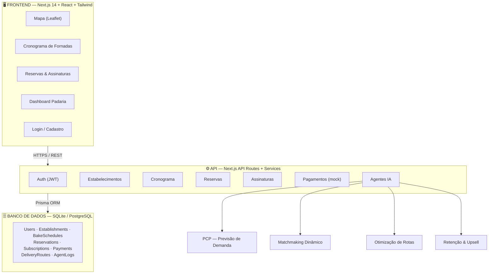

### 2.2 Diagrama de componentes

```mermaid
graph LR
    subgraph Cliente
        C1[Consumidor]
        C2[Operador]
        C3[ADM Padaria]
    end

    subgraph Frontend
        P1[/mapa]
        P2[/cronograma]
        P3[/reservas]
        P4[/assinaturas]
        P5[/dashboard]
    end

    subgraph Backend
        R1[API Routes]
        R2[Services Layer]
        R3[Agents Layer]
    end

    subgraph Dados
        DB[(SQLite)]
    end

    C1 --> P1 & P2 & P3 & P4
    C2 --> P5
    C3 --> P5
    P1 & P2 & P3 & P4 & P5 --> R1
    R1 --> R2
    R2 --> R3
    R2 --> DB
    R3 --> DB
```

### 2.3 Fluxo principal do sistema

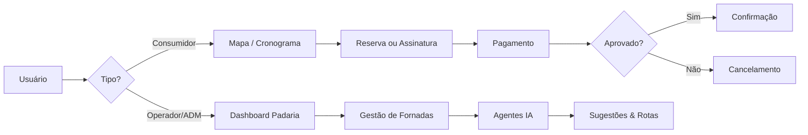

---

## 3. Tipos de Usuários e Permissões

| Papel | Permissões |
|-------|-----------|
| **Consumidor** | Visualizar mapa e cronogramas; criar reservas; assinar planos; pagar; receber notificações |
| **Estabelecimento — ADM** | CRUD completo do estabelecimento; gerenciar operadores; cronograma de fornadas; relatórios; rotas |
| **Estabelecimento — Operador** | Atualizar status de fornadas; confirmar reservas; marcar entregas |

### 3.1 Diagrama de papéis e acesso

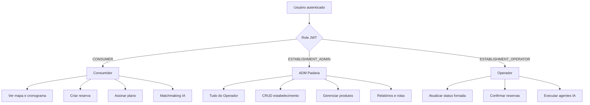

### 3.2 Matriz de permissões

| Ação | Consumidor | Operador | ADM |
|------|:----------:|:--------:|:---:|
| Ver mapa / cronograma | ✅ | ✅ | ✅ |
| Criar reserva | ✅ | ❌ | ❌ |
| Criar / atualizar fornada | ❌ | ✅ | ✅ |
| Gerenciar estabelecimento | ❌ | ❌ | ✅ |
| Executar agentes IA | ❌ | ✅ | ✅ |
| Matchmaking (buscar pão quente) | ✅ | ✅ | ✅ |

---

## 4. Módulos Funcionais

### 4.1 Cadastro de Estabelecimento
- Nome, endereço, coordenadas (lat/lng), horário de funcionamento
- Produtos oferecidos (pão francês, pão de queijo, etc.)
- Vinculação a usuário ADM

### 4.2 Cronograma de Paozinho Quente
- Fornadas programadas com horário previsto de saída
- Status: `scheduled` → `baking` → `ready` → `sold_out`
- Quantidade estimada e disponível para reserva

### 4.3 Mapa de Padarias Próximas
- Busca por raio (km) a partir da localização do consumidor
- Filtro por padarias com fornada `ready` ou `baking` (prestes a sair)
- Exibição de distância e próximo horário de pão quente

### 4.4 Cadastro de Usuário
- Email, senha, nome, endereço (consumidor)
- Roles: `CONSUMER`, `ESTABLISHMENT_ADMIN`, `ESTABLISHMENT_OPERATOR`

### 4.5 Assinaturas (Subscription)
- Planos mensais com entrega recorrente
- Integração com gateway de pagamento (Stripe mock)
- Cashback acumulado por fidelidade

### 4.6 Sistema de Agendamento e Reserva
- Reserva vinculada a uma fornada específica
- Pagamento na reserva (pré-pago)
- Confirmação automática ou manual pelo operador

### 4.7 Pagamento
- Mock gateway para desenvolvimento
- Webhook simulado para confirmação
- Suporte a pagamento único (reserva) e recorrente (assinatura)

### 4.8 Fluxograma — Ciclo de vida da fornada

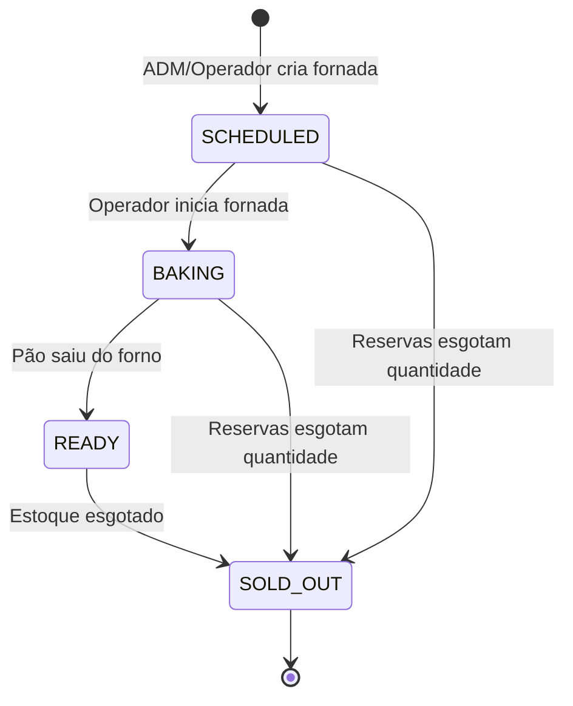

### 4.9 Fluxograma — Reserva com pagamento

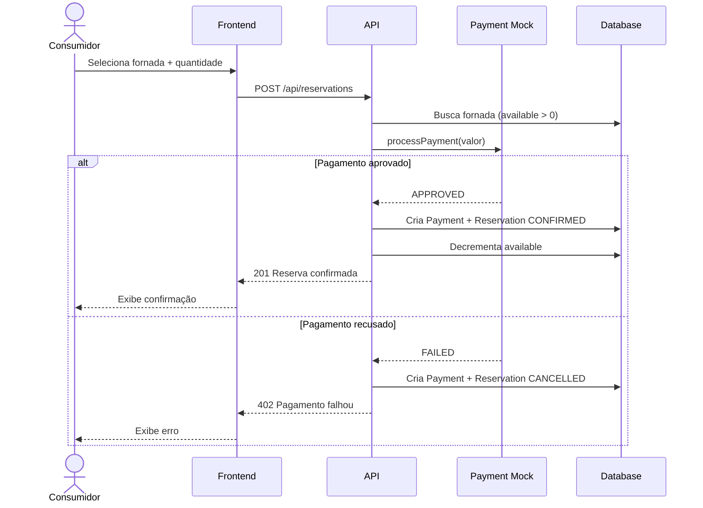

### 4.10 Fluxograma — Assinatura com cashback

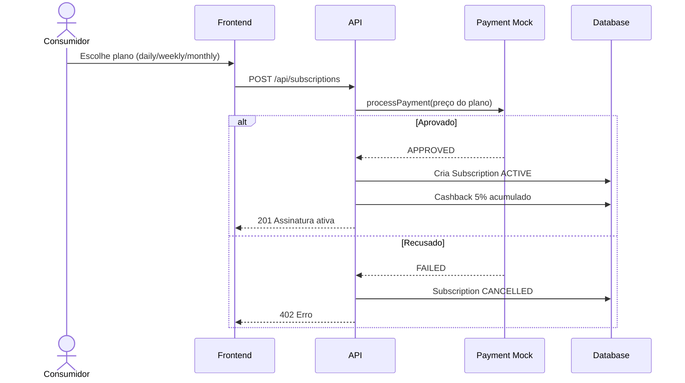

### 4.11 Fluxograma — Autenticação

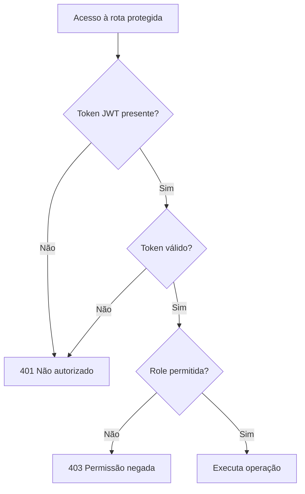

### 4.12 Fluxograma — Mapa e matchmaking

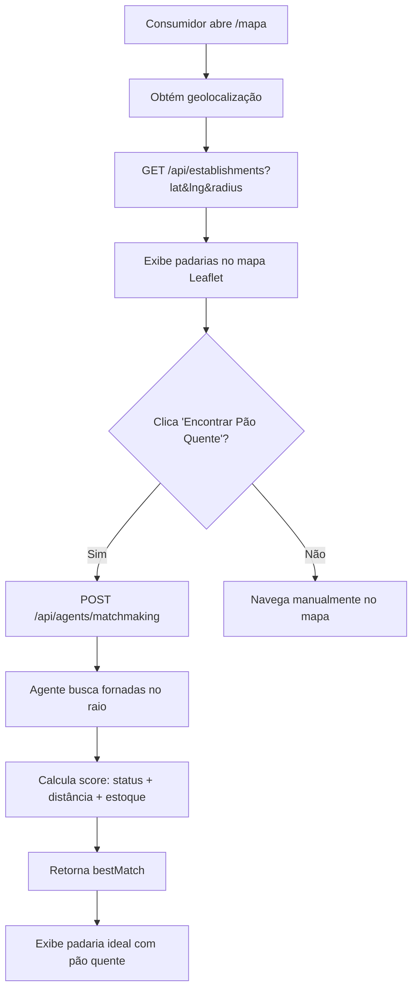

---

## 5. Agentes de IA (Diferenciais)

### 5.1 Agente de Previsão de Demanda (PCP Autônomo)
- **Entrada:** assinaturas ativas + histórico de pedidos ad-hoc
- **Saída:** sugestão de quantidade por fornada e horário
- **Algoritmo:** média móvel ponderada + sazonalidade por dia da semana

### 5.2 Agente de Matchmaking Dinâmico
- **Entrada:** pedido ad-hoc (produto, localização, urgência)
- **Saída:** padaria otimizada com pão recém-saído ou prestes a sair
- **Critérios:** distância, status da fornada, entregadores disponíveis

### 5.3 Agente de Otimização de Rotas de Assinatura
- **Entrada:** pedidos recorrentes do dia + endereços
- **Saída:** rota otimizada agrupando vizinhos/bairros
- **Algoritmo:** nearest-neighbor + clustering por bairro

### 5.4 Agente de Retenção e Upsell
- **Entrada:** histórico de compras do consumidor + fornadas do dia
- **Saída:** notificação contextual com oferta personalizada
- **Exemplo:** "Você costuma pedir pão de queijo às sextas. A Padaria X acabou de tirar uma fornada!"

### 5.5 Diagrama — Ecossistema de agentes IA

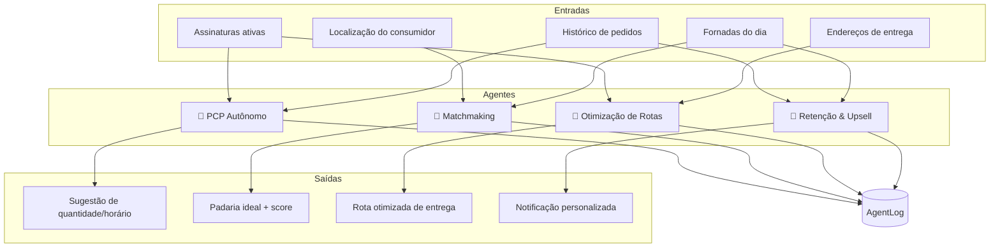

### 5.6 Fluxograma — Agente de Matchmaking

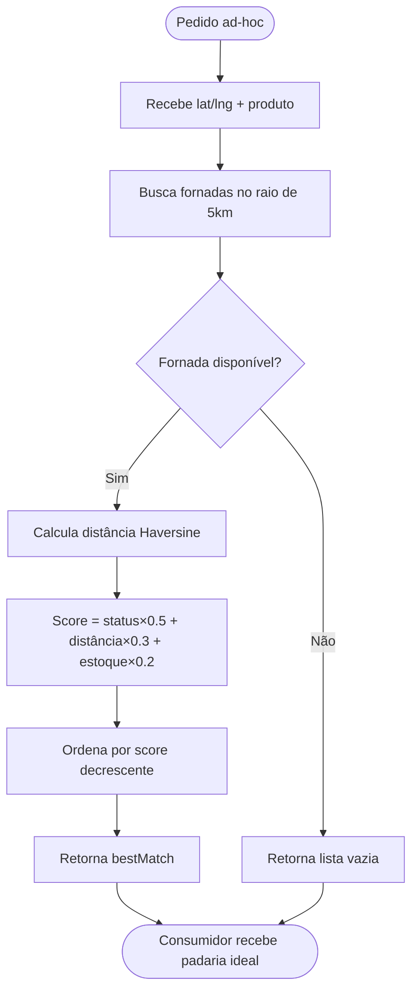

### 5.7 Fluxograma — Agente PCP (Previsão de Demanda)

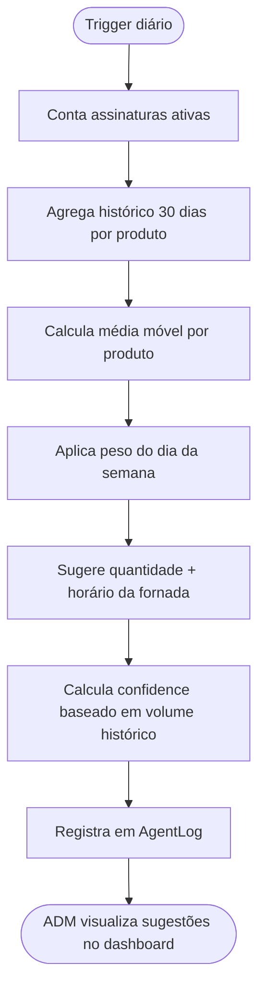

### 5.8 Fluxograma — Agente de Rotas

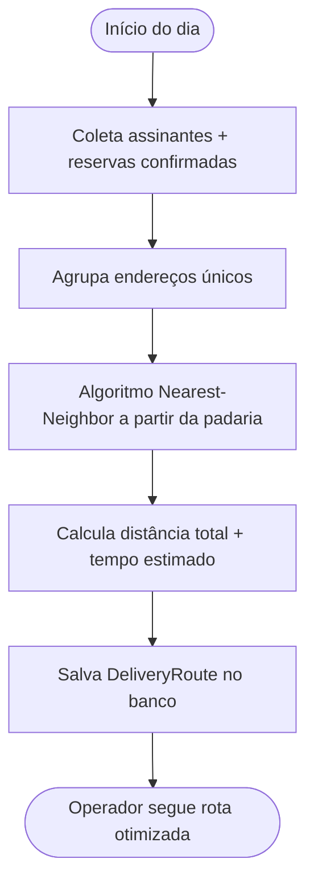

---

## 6. Modelo de Dados (Entidades)

### 6.1 Diagrama entidade-relacionamento (ER)

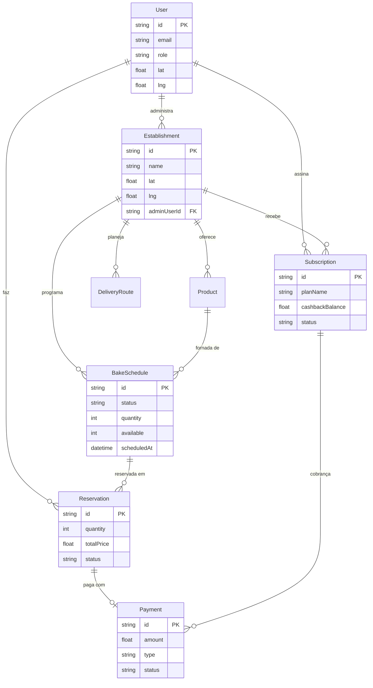

### 6.2 Visão simplificada

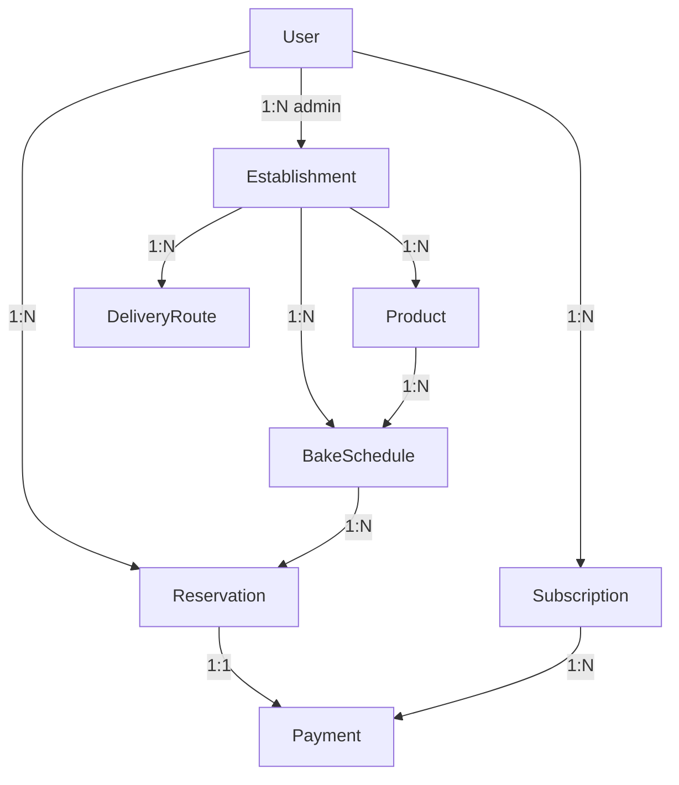

---

## 7. Stack Tecnológica

| Camada | Tecnologia |
|--------|-----------|
| Frontend | Next.js 14, React 18, Tailwind CSS, Leaflet |
| Backend | Next.js API Routes, TypeScript |
| ORM | Prisma |
| Banco | SQLite (dev) / PostgreSQL (prod) |
| Auth | JWT (jsonwebtoken + bcryptjs) |
| Agentes | TypeScript services (extensível para LLM) |

---

## 8. Estrutura de Diretórios

```
/
├── context/              # Arquivos de contexto para AI-Driven Development
├── docs/
│   └── ARQUITETURA.md    # Este documento
├── prisma/
│   ├── schema.prisma
│   └── seed.ts
├── src/
│   ├── app/              # Pages + API Routes
│   ├── components/       # UI Components
│   ├── lib/              # Utils, auth, db
│   └── services/
│       └── agents/       # Agentes de IA
└── README.md
```

---

## 9. Endpoints da API

| Método | Rota | Descrição |
|--------|------|-----------|
| POST | `/api/auth/register` | Cadastro de usuário |
| POST | `/api/auth/login` | Login |
| GET | `/api/establishments` | Listar padarias (com filtro geo) |
| POST | `/api/establishments` | Cadastrar padaria |
| GET | `/api/schedules` | Cronograma de fornadas |
| POST | `/api/schedules` | Criar fornada |
| PATCH | `/api/schedules/[id]` | Atualizar status da fornada |
| POST | `/api/reservations` | Criar reserva + pagamento |
| GET | `/api/subscriptions` | Listar assinaturas |
| POST | `/api/subscriptions` | Criar assinatura |
| POST | `/api/agents/demand-prediction` | Executar agente PCP |
| POST | `/api/agents/matchmaking` | Executar matchmaking |
| POST | `/api/agents/route-optimization` | Otimizar rotas |
| POST | `/api/agents/retention` | Gerar upsells |

### 9.1 Diagrama de integração da API

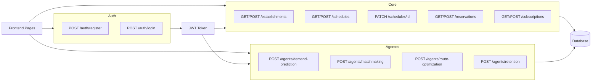

### 9.2 Fluxo de deploy

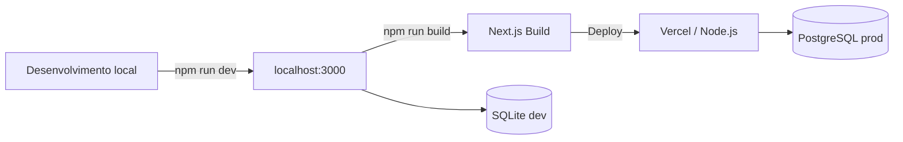

---

## 10. Decisões Arquiteturais

1. **Monolito modular (Next.js):** simplifica deploy e atende ao escopo do curso; camadas bem separadas permitem extração futura.
2. **SQLite em dev:** zero configuração; migração para PostgreSQL é trivial via Prisma.
3. **Agentes como services TypeScript:** lógica determinística inicial, pronta para integração com LLM (OpenAI/Anthropic) sem refatoração.
4. **Pagamento mock:** simula fluxo completo sem credenciais reais; interface compatível com Stripe.
5. **Context files:** diretório `context/` alimenta o desenvolvimento assistido por IA conforme metodologia AI-Driven Development.

---

## 11. Roadmap

- [x] MVP: cadastros, cronograma, mapa, reservas
- [x] Agentes IA (lógica base)
- [x] Assinaturas + pagamento mock
- [ ] Integração Stripe real
- [ ] Push notifications (Firebase)
- [ ] App mobile (React Native)
- [ ] LLM nos agentes de retenção e matchmaking
